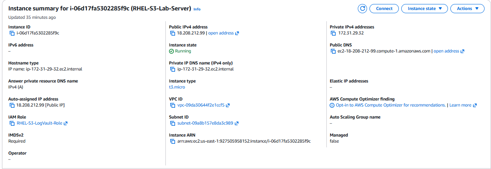
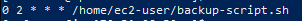
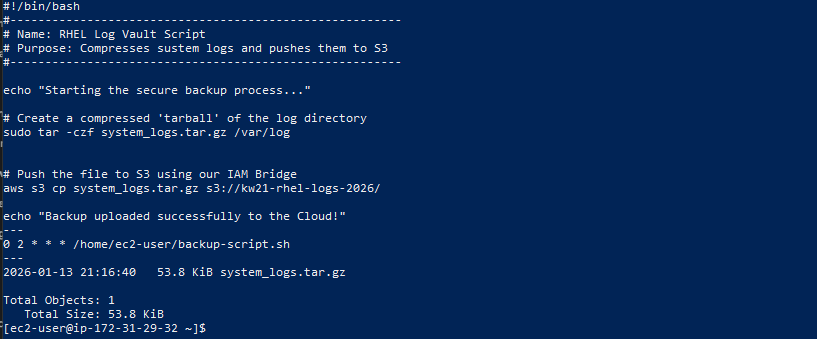

# Project: Automated RHEL 9 System Log Synchronization to Amazon S3

## Executive Summary
This project demonstrates the implementation of a secure, automated backup pipeline for Red Hat Enterprise Linux (RHEL 9) system logs. The solution utilizes a Bash-based automation script and the AWS Command Line Interface (CLI) to synchronize compressed log archives to an Amazon S3 "Log Vault". The architecture emphasizes security by utilizing IAM Roles for keyless authentication, effectively removing the risk of hardcoded credentials.

## Technical Architecture
* **Operating System**: Red Hat Enterprise Linux 9 (Amazon EC2 t3.micro)
* **Cloud Storage**: Amazon S3 (Bucket: kw21-rhel-logs-2026)
* **Identity Management**: IAM Instance Profile with custom JSON policy
* **Automation Engine**: Linux Crontab (Daily execution at 02:00)

## Core Technical Implementations

### Identity and Access Management (IAM)
The EC2 instance is associated with a specific IAM Role (RHEL-S3-LogVault-Role), granting the server a dedicated identity. By utilizing an Instance Profile, the automation script retrieves temporary security credentials from the Instance Metadata Service (IMDSv2), adhering to the security principle of least privilege.

### Automation Logic
A Bash script was developed to handle the lifecycle of the backup:
1. Administrative compression of the /var/log directory using the tar utility.
2. Secure data transfer to the target S3 bucket via the AWS CLI.
3. Automated scheduling via Crontab to ensure high availability and data durability without manual intervention.

## Verification and Proof of Concept

### 1. Infrastructure Summary
The following image confirms the EC2 instance configuration, including the attached IAM Role for secure S3 access.

### 2. Operational Schedule
This image verifies the Crontab configuration, confirming the daily 02:00 AM automation trigger.

### 3. Full-Stack Execution and Cloud Confirmation
The terminal output below verifies the successful execution of the Bash script, the active cron schedule, and the presence of the compressed archive within the S3 bucket.

